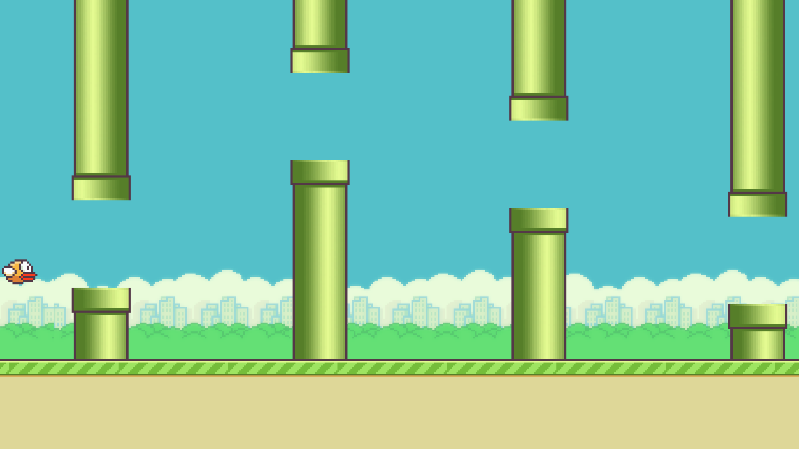

# **Flappy Bird**
A flappy bird game written in C programming language. Uses a powerful graphics library called SDL (Simple DirectMedia Layer) library.
## **STATUS:** IN PROGRESS
 

# **Preview**
 Main Menu </img>
  
 Gameplay </img>
  
 Leaderboards </img>
  

# **Roadmap**
* Add the main game logic
* Add ability to switch game to pause state and handle pause state
* Add ability to switch game from pause state to main menu
* Add ability to store the game results
* Add ability to display game results in leaderboard page