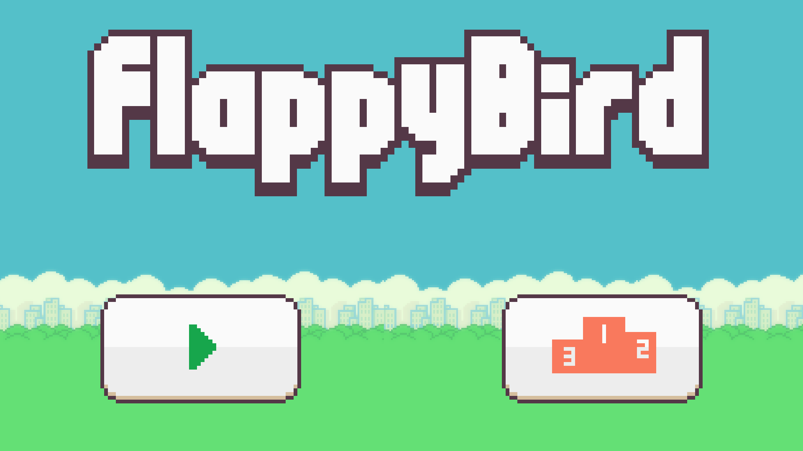
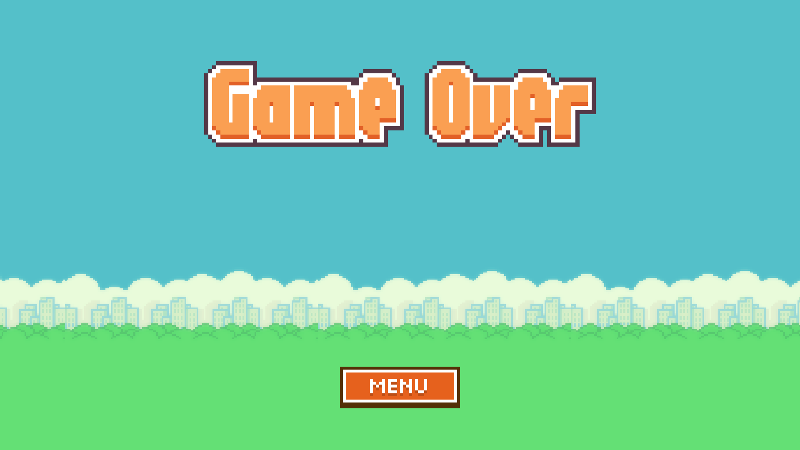
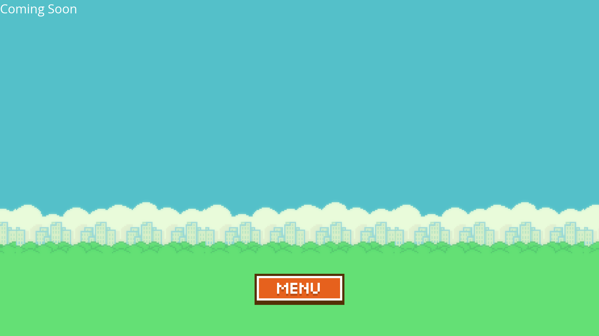

# **Flappy Bird**
A flappy bird game written in C programming language. Uses a powerful graphics library called SDL (Simple DirectMedia Layer) library. Designed to adapt to different screen resolutions. Tested and verified to work correctly on displays with resolutions from 800x600 upto 1920x1080.

**STATUS:** IN PROGRESS

# **Resources**
* Tileset: https://www.spriters-resource.com/mobile/flappybird/sheet/59894/

# **Preview**
 Main Menu Preview</img>
  
 Gameplay Preview</img>
  
 Game Over Preview</img>
  
 Leaderboards Preview</img>
  

# **Roadmap**
* Add ability to switch game from pause state to main menu
* Add ability to store the game results
* Add ability to display game results in leaderboard page